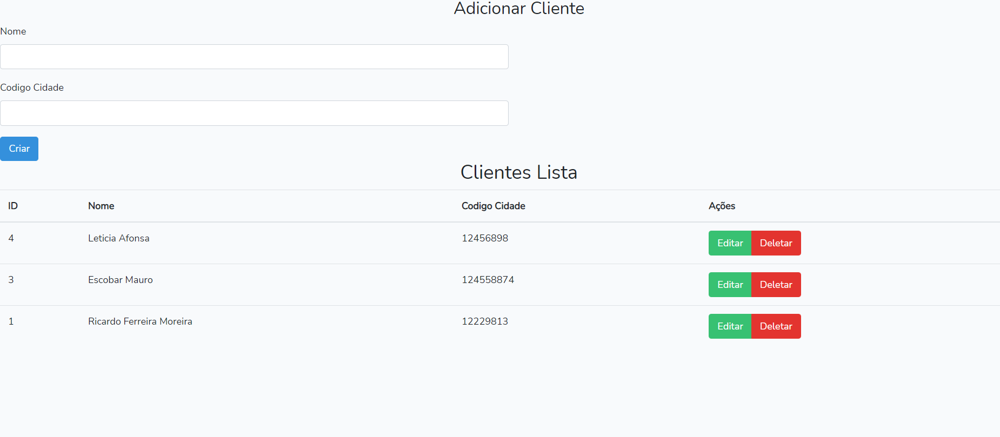

#sistema de cadastro de clientes com Laravel e Vue

o sistema roda na seguinte url

http://localhost/sticrud/public/

os dados da API roda no seguinte endereço

http://localhost:8000/api/clientes

as tabelas estão no arquivo

sti.sql

tela do sistema abaixo

